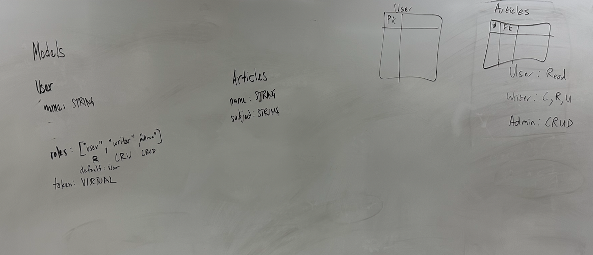
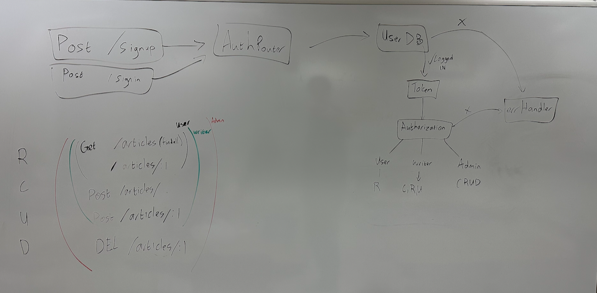

# article-auth-api

Framework around a role-based, authenticated, authorized CRUD express server for writing articles.

## Setup
- `.env` requirements
  - PORT: Port Number to run server

## Install & Usage
- to install:
  - `npm install`
- to run:
  - `npm run dev`

## Contributers
- Chester Coloma
- Christian Tojot
- Paul Brown
- David Danilchik
